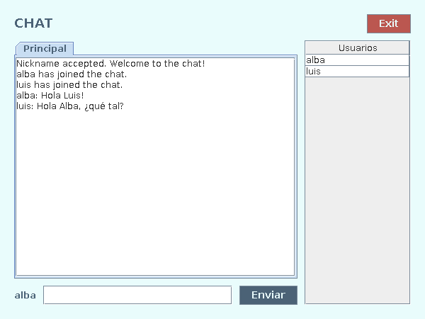

# ProyectoChat 💬

[](https://github.com/alba-alonso-dev/ProyectoChat/actions/workflows/ci.yml)

Chat de escritorio multiusuario en **Java** que combina **sockets TCP** (cliente → servidor) con **UDP multicast** (servidor → clientes). Hecho como proyecto de la asignatura *Programación de Servicios y Procesos* (DAM).

> Objetivo: practicar programación en red a bajo nivel (sockets, hilos, concurrencia, serialización y multicast) sin usar frameworks.



---

## ✨ Funcionalidades

- Conexión de varios clientes a un servidor central.
- Elección de *nickname* único y validado por el servidor, sin condiciones de carrera.
- Mensajes en tiempo real para todos los usuarios conectados.
- Lista de usuarios conectados que se actualiza al entrar o salir alguien.
- Detección de la caída del servidor desde el cliente.
- Configuración externa (IP, puertos, grupo multicast) en `config.xml` o por línea de comandos.
- Interfaz gráfica con Java Swing que no se bloquea durante las operaciones de red.

## 🏗️ Arquitectura

```
        ┌──────────────┐   TCP (nickname, mensajes)   ┌──────────────────────┐
        │  Cliente A   │ ───────────────────────────▶ │                      │
        └──────────────┘                              │     ChatServer       │
        ┌──────────────┐   TCP                        │  (pool de hilos,     │
        │  Cliente B   │ ───────────────────────────▶ │   uno por cliente)   │
        └──────────────┘                              └──────────┬───────────┘
               ▲  ▲                                              │
               │  └──────────── UDP multicast 239.0.0.1:8888 ────┘
               └─────────────── (mensajes + lista de usuarios)
```

1. El cliente abre una conexión **TCP** con el servidor y negocia su nickname.
2. Cada mensaje que escribe el usuario viaja por TCP al servidor.
3. El servidor lo reenvía una sola vez al **grupo multicast**; todos los clientes suscritos lo reciben.
4. Los cambios de conexión (`ConnectionData`) llevan la lista actualizada de usuarios.

**¿Por qué TCP + multicast?** TCP garantiza que el servidor recibe cada mensaje y permite controlar quién está conectado. Multicast permite que el servidor envíe **un único paquete** para todos, en lugar de uno por cliente. El coste: UDP no garantiza entrega ni orden, y el multicast solo funciona dentro de una red local.

### Decisiones técnicas

| Problema | Solución |
|---|---|
| Varios hilos acceden a la lista de clientes | `ConcurrentHashMap` + `putIfAbsent` (comprobar y reservar el nickname en una operación atómica) |
| La interfaz se congelaba esperando al servidor | La red va en un hilo propio; Swing solo se toca desde el EDT (`SwingUtilities.invokeLater`) |
| Deserializar datos de la red es peligroso | `ObjectInputFilter` con lista blanca: solo se aceptan las clases del protocolo |
| Mensajes grandes se truncaban en UDP | Buffer de 64 KB y límite de longitud de mensaje |
| Ataques XXE al leer XML | DTDs deshabilitadas en el parser de `config.xml` |

## 📁 Estructura

```
src/main/java/io/github/albaalonso/chat/
├── servidor/ChatServer.java             # Acepta conexiones TCP y difunde por multicast
├── cliente/
│   ├── ChatClient.java                  # Conexión TCP, handshake y envío de mensajes
│   ├── MessageReceiverThread.java       # Hilo que escucha el grupo multicast
│   └── vista/                           # Ventana Swing (VChat) y diálogos
└── common/
    ├── message/                         # Mensajes serializables e inmutables
    ├── protocol/Protocol.java           # Reglas del protocolo y serialización segura
    └── config/ConfigManager.java        # Lectura de config.xml
src/main/resources/                      # config.xml e icono
src/test/java/                           # Tests JUnit 5
docs/                                    # Manual de usuario y documentación
```

## 🚀 Cómo ejecutarlo

### Requisitos

- JDK 17 o superior.
- Maven 3.9+ (o el que trae integrado IntelliJ IDEA).
- Servidor y clientes en la **misma red local** (requisito del multicast).

### Con Maven

```bash
git clone https://github.com/alba-alonso-dev/ProyectoChat.git
cd ProyectoChat

mvn test                   # ejecutar los tests
mvn exec:java@servidor     # terminal 1: arrancar el servidor
mvn exec:java@cliente      # terminal 2, 3...: un cliente por usuario
```

### Con el .jar

```bash
mvn package
java -cp target/proyectochat.jar io.github.albaalonso.chat.servidor.ChatServer
java -cp target/proyectochat.jar io.github.albaalonso.chat.cliente.ChatClient
```

### Desde IntelliJ IDEA

Abrir la carpeta del proyecto (IntelliJ detecta el `pom.xml`) y ejecutar `ChatServer` y `ChatClient`. Para abrir varios clientes: *Run configuration → Modify options → Allow multiple instances*.

### Configuración

Los valores por defecto están en `src/main/resources/config.xml`:

```xml
<config>
    <icon_path>img/icon.png</icon_path>
    <server_ip>127.0.0.1</server_ip>       <!-- IP del servidor -->
    <server_port>12345</server_port>       <!-- Puerto TCP -->
    <broadcast_ip>239.0.0.1</broadcast_ip> <!-- Grupo multicast -->
    <broadcast_port>8888</broadcast_port>  <!-- Puerto UDP -->
    <debug>false</debug>                   <!-- Logs detallados -->
</config>
```

Para cambiarlos sin recompilar hay dos opciones:

- Poner un `config.xml` en el directorio desde el que se ejecuta.
- Pasar propiedades al arrancar, por ejemplo para conectarse a otro equipo de la red:

  ```bash
  java -Dchat.server_ip=192.168.1.20 -cp target/proyectochat.jar io.github.albaalonso.chat.cliente.ChatClient
  ```

## 🧪 Tests

```bash
mvn test
```

- **Protocolo**: validación de nicknames, serialización y rechazo de clases no permitidas.
- **Configuración**: lectura del XML, errores claros y sobrescritura por propiedades.
- **Servidor**: handshake real por TCP con clientes de prueba, incluido un test de concurrencia en el que 20 clientes piden el mismo nickname a la vez y solo uno lo consigue.

Los tests se ejecutan automáticamente en cada push con GitHub Actions.

## 📚 Documentación

- [Manual de usuario](docs/Manual%20de%20Usuario.pdf)
- [Método de transmisión](docs/Metodo%20de%20trasmision.pdf)
- JavaDoc: `mvn javadoc:javadoc` y abrir `target/reports/apidocs/index.html`.

## ⚠️ Limitaciones conocidas

Proyecto académico, no pensado para producción:

- El multicast solo funciona en LAN (no atraviesa Internet ni la mayoría de redes wifi públicas).
- Los mensajes viajan **sin cifrar** y cualquier equipo de la red puede unirse al grupo y leerlos.
- UDP no garantiza la entrega: en redes con pérdidas puede faltar algún mensaje.

## 🗺️ Próximos pasos

- [ ] Mensajes privados entre usuarios.
- [ ] Protocolo en JSON en lugar de serialización Java.
- [ ] Versión web: backend Spring Boot con WebSockets (STOMP) y frontend Angular.

## 🛠️ Tecnologías

Java 17 · Swing · Sockets TCP · UDP Multicast · Concurrencia · Maven · JUnit 5 · GitHub Actions

## 👤 Autoría

**Alba Alonso** — [GitHub](https://github.com/alba-alonso-dev)
